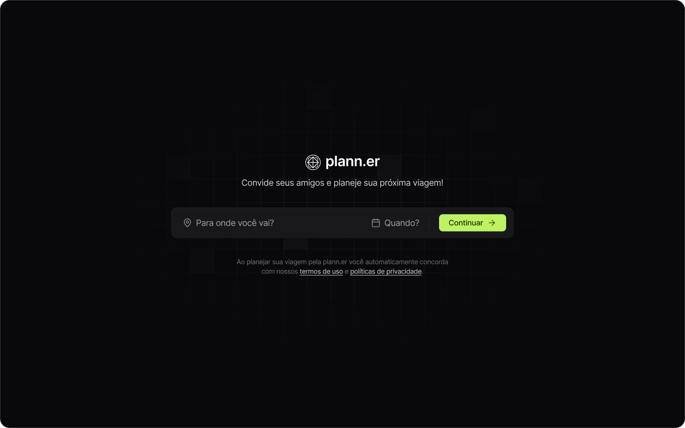

<strong><h1 align="center">plann.er</h1></strong>

<p align="center">
  
</p>


## Introdução
O projeto é um site desktop para montar planos de viagem com amigos, registrar atividades e links úteis.

* [Requisitos](#requisitos)
* [Como contribuir](#como-contribuir)
* [Ambiente de desenvolvimento](#ambiente-de-desenvolvimento)

## Requisitos

* node >= 18.1

## Como contribuir

Para contribuir com o projeto basta seguir os seguintes passos.

### Novo recurso

* Criar um branch a partir do branch develop


### Hotfix

* Criar um branch a partir do branch main


## Ambiente de desenvolvimento

Para executar o projeto em seu ambiente local, basta clonar o projeto
em sua maquina local.

Para alteracoes de variaveis de git

```sh
git clone https://github.com/diegorondao/vite-tailwindcss-trip-planner.git
```

Acessar o diretório do vite-tailwindcss-trip-planner

```sh
cd vite-tailwindcss-trip-planner
```

Instalar dependências

```sh
yarn install
# ou
npm install
```

Executar o projeto

```sh
yarn start
# ou
npm start
```

Testar o projeto com Jest

```sh
yarn run test
# ou
npm run test
```
Testar o projeto com ESLint
```sh
yarn run lint
# ou
npm run lint
```
